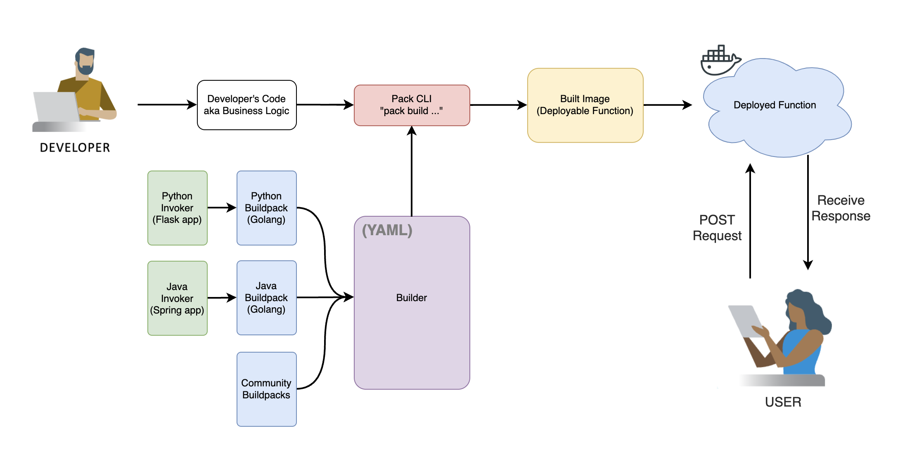

# Contributing to function-buildpacks-for-knative

The function-buildpacks-for-knative project team welcomes contributions from the community. Before you start working with function-buildpacks-for-knative, please
read our [Developer Certificate of Origin](https://cla.vmware.com/dco). All contributions to this repository must be
signed as described on that page. Your signature certifies that you wrote the patch or have the right to pass it on
as an open-source patch.

## Development Flow



As you can see in the diagram's example above, a developer is using one of our Function Templates to write their code into. They run `pack build <name> --builder <builder-version>` to build a version of their code with dependencies included, then they run it in Docker locally to interact as an end user. This is a potential open-source use-case; a Tanzu Application involved use-case would skip several steps and run `tanzu workload create`. 

If we break down what the `--builder` flag entains, it runs the builder provided against our code. This builder could be our provided URL _or_ a local path for an experimental builder.

### Working with the packages in the repository

The `invokers` layer is the lowest level package. They have no dependencies and are the "invokers" of the function. They are responsible for running the function and exposing the function's port. They are also responsible for setting up the environment variables that the function will need to run.

An abstraction level above, `buildpacks` uses `invokers` as a dependency along with bundling other dependencies. The `buildpacks` layer is responsible for taking the function code and bundling it with the invoker. It is also responsible for setting up the environment variables that the function will need to run.

Lastly, at the highest level, the `builder` references the `buildpacks` by URI and SHA as an aggregator. The `builder` is responsible for aggregating the buildpacks and invokers into a single image that can be used to build functions.

Each layer has a branch for each language we support. For example, the python invoker for version 0.0.1 will have a branch python-invoker/v0.0.x where we develop and patch that version. The same goes for the buildpacks and builder. The builder will have a branch for each version of the builder. For example, the builder for version 0.0.1 will have a branch builder/v0.0.x where we work all patches of that version.

If you want to work on a new version of any package you can create a new branch for that version from main. For example, if you want to work on the builder for version 0.1.0 you can create a branch builder/v0.1.x from main. If you want to work on a new version of the python invoker you can create a branch python-invoker/v0.1.x from main. If you want to work on a new version of the python buildpack you can create a branch python-buildpack/v0.1.x from main. 

On the other hand, if you want to extend or patch a specific version of a package, you can check the branch of that specific version (for minor and major versions), and work on that branch. Then, to cut a new release from that branch simply create a new tag with the version you want to release. For example, if you want to patch the python invoker for version 0.0.1 you can work from the branch python-invoker/v0.0.x and create the tag python-invoker/v0.0.1 after you are finished, and push the tag to the remote repository. The same goes for the buildpacks and builder (after the PR from your changes are merged in the python-invoker/v0.0.x).

## Layers Explained

The function-buildpacks-for-knative project is organized into "layers" that sum into our functions experience. These layers create an image that can be used to deploy a FaaS experience in a few short commands.

The `invokers` layer is the lowest level package.

An abstraction level above, `buildpacks` uses `invokers` as a dependency along with bundling other dependencies.

Lastly, at the highest level, the `builder` references the `buildpacks` by URI and SHA as an aggregator. 

The end user should only be interacting with the builder. The name is as it implies -- the builder "builds" functions into images. Interacting with the invokers directly, for example, breaks the abstraction barrier. To learn more about each layer, you may read the `README` for each respective layer's directory.

New additions to the `samples/` and `templates/` directories are welcome -- each directory also has information about usage and testing. We can only accept PRs for these that DO NOT include imports from unvetted repositories or infringing licenses. Please keep them as lightweight and template-able as possible.

To deploy your work, see [DEPLOYING](DEPLOYING.md).

To learn how to test your work, read the [testing documentation](/tests/README.md). We will not accept PRs that fail any tests. If you are including any feature additions, templates, samples, or breaking changes, it is expected that a corresponding test will be added.

> **Note:** To use your own registry for local development and tests, copy and edit [local.example.mk](/local.example.mk) to set the registry to one for which you have read/write access.
> Be sure to also run `make clean` any time you adjust the registry value.

## Contribution Flow

This is a rough outline of what a contributor's workflow looks like:

- Create a topic branch from where you want to base your work
- Make commits of logical units
- Make sure your commit messages are in the proper format (see below) and signed
- Push your changes to a topic branch in your fork of the repository
- Submit a pull request

> ⚠️ You MUST accept the VMware DCO first and SIGN your commits with your legal name, e.g.: "Signed-off-by: John Doe <johndoe@example.com>" will be on a newline at the end of every commit message. You can do this by using `git commit -s -m ...` with the addition of the `-s` flag.

Example:

``` shell
git remote add upstream https://github.com/vmware/function-buildpacks-for-knative.git
git checkout -b my-new-feature main
git add <your-changes>
git commit -s -m "my message here"
git push origin my-new-feature
```

### Staying In Sync With Upstream

When your branch gets out of sync with the vmware/main branch, use the following to update:

``` shell
git checkout my-new-feature
git fetch -a
git pull --rebase upstream main
git push --force-with-lease origin my-new-feature
```

### Updating pull requests

If your PR fails to pass CI or needs changes based on code review, you'll most likely want to squash these changes into
existing commits.

If your pull request contains a single commit or your changes are related to the most recent commit, you can simply
amend the commit.

``` shell
git add .
git commit --amend
git push --force-with-lease origin my-new-feature
```

If you need to squash changes into an earlier commit, you can use:

``` shell
git add .
git commit --fixup <commit>
git rebase -i --autosquash main
git push --force-with-lease origin my-new-feature
```

Be sure to add a comment to the PR indicating your new changes are ready to review, as GitHub does not generate a
notification when you git push.

### Code Style

### Formatting Commit Messages

We follow the conventions on [How to Write a Git Commit Message](http://chris.beams.io/posts/git-commit/).

Be sure to include any related GitHub issue references in the commit message.  See
[GFM syntax](https://guides.github.com/features/mastering-markdown/#GitHub-flavored-markdown) for referencing issues
and commits.

## Reporting Bugs and Creating Issues

When opening a new issue, try to roughly follow the commit message format conventions above.
